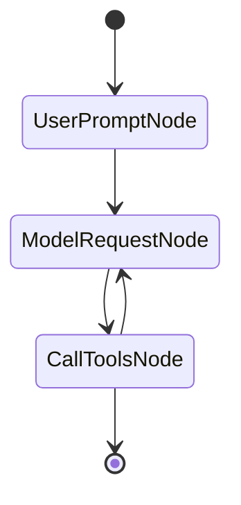

# 六、pydantic_graph 图执行引擎

> **核心文件**：`pydantic_graph/graph.py`、`pydantic_graph/nodes.py`、`pydantic_graph/persistence/`、`pydantic_graph/beta/`

---

## 6.1 设计定位

`pydantic_graph` 是 pydantic-ai 的底层图执行引擎，但它是一个**独立的包**，可以脱离 pydantic-ai 单独使用。

```
pydantic_ai            pydantic_graph
┌────────────────┐     ┌──────────────────────────────┐
│  AgentNode     │────▶│  BaseNode                    │
│  (继承自 →)    │     │  + run() → BaseNode | End    │
│                │     │                              │
│  GraphAgentState───▶ │  StateT（图状态泛型）         │
│                │     │                              │
│  GraphAgentDeps────▶ │  DepsT（依赖泛型）            │
│                │     │                              │
│  FinalResult   │◀────│  RunEndT（结束数据泛型）       │
└────────────────┘     └──────────────────────────────┘
```

---

## 6.2 核心抽象（nodes.py）

### GraphRunContext — 节点执行上下文

```python
@dataclass(kw_only=True)
class GraphRunContext(Generic[StateT, DepsT]):
    state: StateT   # 图状态（所有节点共享，可变）
    deps: DepsT     # 图依赖（只读，整个 run 不变）
```

所有节点通过 `GraphRunContext` 访问状态和依赖。

### BaseNode — 节点基类

```python
class BaseNode(ABC, Generic[StateT, DepsT, NodeRunEndT]):

    @abstractmethod
    async def run(
        self, ctx: GraphRunContext[StateT, DepsT]
    ) -> BaseNode[StateT, DepsT, Any] | End[NodeRunEndT]:
        """执行节点逻辑，返回下一个节点或 End。

        ⚠️ 返回类型注解在运行时被分析，用于：
        - 验证图结构合法性
        - 生成 Mermaid 图表
        """
```

**关键设计**：节点的返回类型注解不仅仅是文档，**在运行时被 `get_node_def()` 方法分析**，提取可能的后继节点集合（`next_node_edges`）。

### End — 结束信号

```python
@dataclass
class End(Generic[RunEndT]):
    """从节点 run() 方法返回以结束图运行。"""
    data: RunEndT   # 最终结果数据
```

### NodeDef — 节点定义（内部元数据）

```python
@dataclass
class NodeDef(Generic[StateT, DepsT, NodeRunEndT]):
    node: type[BaseNode]
    node_id: str                           # 类名
    note: str | None                       # Mermaid 注释
    next_node_edges: dict[str, Edge]       # 后继节点集合
    end_edge: Edge | None                  # 是否可以结束
    returns_base_node: bool                # 是否返回泛型 BaseNode（动态路由）
```

---

## 6.3 Graph 类（经典版）

**文件**：`pydantic_graph/graph.py`

```python
class Graph(Generic[StateT, DepsT, RunEndT]):
    """图定义——静态定义，节点类型在初始化时声明。"""

    node_defs: dict[str, NodeDef]  # 注册的所有节点定义
    name: str | None
    auto_instrument: bool           # 是否自动创建 OTel Span
```

### 图的初始化与验证

```python
never_42_graph = Graph(nodes=(Increment, Check42))
```

初始化时：
1. 调用 `get_node_def()` 分析每个节点的返回类型注解
2. `_validate_edges()` 验证所有引用的节点都已注册
3. 如果某个节点的 run() 返回了未注册的节点类型，抛出 `GraphSetupError`

### Graph.run — 同步风格的完整运行

```python
async def run(
    self,
    start_node: BaseNode[StateT, DepsT, RunEndT],
    *,
    state: StateT = None,
    deps: DepsT = None,
    persistence: BaseStatePersistence | None = None,
) -> GraphRunResult[StateT, RunEndT]:
    """从起始节点运行直到 End，返回最终结果。"""
```

### Graph.iter — 迭代式运行（pydantic-ai 使用此接口）

```python
@asynccontextmanager
async def iter(
    self,
    start_node: BaseNode,
    *,
    state: StateT = None,
    deps: DepsT = None,
    persistence: BaseStatePersistence | None = None,
) -> AsyncIterator[GraphRun]:
    """Yield 一个 GraphRun，允许逐节点观察。"""
    yield GraphRun(...)
```

`pydantic-ai` 的 `AgentRun` 内部使用 `graph.iter()` 获取 `GraphRun`，然后通过 `AgentRun.__aiter__` 将其包装后暴露给用户。

---

## 6.4 GraphRun — 运行时执行引擎

```python
class GraphRun(Generic[StateT, DepsT, RunEndT]):
    """图的一次运行实例，管理迭代状态。"""

    state: StateT                   # 当前图状态
    deps: DepsT                     # 图依赖
    next_task: GraphTaskRequest | None  # 下一个待执行的任务
```

### 节点执行逻辑

```
GraphRun.__aiter__()
  └── 循环 yield 节点，直到 next_node 是 End：
        ├── await persistence.snapshot_node(state, next_node)
        ├── ctx = GraphRunContext(state=state, deps=deps)
        ├── result = await next_node.run(ctx)
        │     ├── BaseNode → 设为下一个节点，继续循环
        │     └── End → 退出循环
        └── 每次节点执行前后，创建 OTel Span（如果 auto_instrument=True）
```

### GraphRun.next — 手动驱动

```python
async def next(
    self,
    node: BaseNode | End | None = None
) -> BaseNode | End | None:
    """手动执行下一个节点（而不是依赖迭代）。"""
```

允许在迭代中跳过某些节点或注入不同的节点（pydantic-ai 的 `AgentRun.next()` 方法）。

---

## 6.5 Beta 版图执行引擎（pydantic_graph/beta/）

Beta 版引入了更强大的功能，pydantic-ai 内部使用 Beta 版的 `Graph` 和 `GraphBuilder`：

```python
from pydantic_graph.beta import Graph, GraphBuilder
```

### GraphBuilder — 动态图构建

与经典版 `Graph`（静态节点集合）不同，`GraphBuilder` 允许动态构建图：

```python
builder = GraphBuilder()
builder.add_node(UserPromptNode)
builder.add_node(ModelRequestNode)
builder.add_node(CallToolsNode)
graph = builder.build()
```

pydantic-ai 在 `_agent_graph.py` 中使用 `GraphBuilder` 动态构建 Agent 图（节点集合根据 Agent 配置而变化）。

### Beta 版的并行执行（Fork/Join）

Beta 版引入了并行执行路径：

```python
class Fork:
    """从当前节点分叉出多条并行路径。"""

class Join(JoinNode):
    """等待所有并行路径完成后汇聚。"""
```

使用 `anyio` 的 `create_task_group()` 实现并行节点执行：

```
Fork(paths=[PathA, PathB, PathC])
  │
  ├── TaskGroup.start() PathA
  ├── TaskGroup.start() PathB
  └── TaskGroup.start() PathC
  │
  └── Join() ← 等待所有路径完成，汇聚结果
```

### Beta 版的流式事件

```python
class NodeStep:
    """表示一个节点的执行步骤，包含输入/输出快照。"""
    node: AnyNode
    input: Any
    output: Any
```

Beta 版通过 `anyio.create_memory_object_stream()` 实现节点事件的流式传递。

---

## 6.6 状态持久化（persistence/）

持久化系统允许图的运行状态在进程重启后恢复（Durable Execution 的基础）。

### BaseStatePersistence — 持久化接口

```python
class BaseStatePersistence(ABC, Generic[StateT, RunEndT]):
    @abstractmethod
    async def snapshot_node(
        self, state: StateT, next_node: BaseNode
    ) -> None:
        """在执行节点前保存快照。"""

    @abstractmethod
    async def snapshot_end(self, state: StateT, end: End) -> None:
        """图执行结束时保存快照。"""

    @abstractmethod
    @asynccontextmanager
    async def record_run(self, snapshot_id: str) -> AsyncIterator[None]:
        """记录节点的执行过程（用于幂等重试）。"""

    @abstractmethod
    async def load_next(self) -> NodeSnapshot | None:
        """加载下一个待执行的节点快照。"""
```

### Snapshot — 状态快照

```python
NodeSnapshot:
    id: str            # 快照唯一 ID（格式：'NodeClassName:uuid4_hex'）
    state: StateT      # 图状态的深拷贝
    node: BaseNode     # 待执行的节点实例
    status: SnapshotStatus  # 'created'|'pending'|'running'|'success'|'error'
    start_ts: datetime | None
    duration: float | None

EndSnapshot:
    id: str
    state: StateT
    result: End[RunEndT]
```

### SimpleStatePersistence — 内存持久化（默认）

```python
class SimpleStatePersistence(BaseStatePersistence):
    last_snapshot: Snapshot | None = None
```

只保留最后一个快照，用于基本的执行跟踪。如果不传 `persistence` 参数，默认使用此实现。

### FileStatePersistence — 文件持久化

```python
class FileStatePersistence(BaseStatePersistence):
    json_file: Path  # JSON 文件路径，存储所有历史快照
```

将所有快照追加保存到 JSON 文件，支持：
- 进程重启后从文件恢复
- `load_all()` 加载完整历史
- 文件级别锁防止并发写入冲突

---

## 6.7 Graph.iter_from_persistence — 从持久化恢复运行

```python
@asynccontextmanager
async def iter_from_persistence(
    self,
    snapshot_id: str,
    persistence: BaseStatePersistence,
) -> AsyncIterator[GraphRun]:
    """从持久化的快照恢复图运行。"""
    # 1. 从 persistence 加载指定 snapshot_id 的状态
    # 2. 恢复 state 和 next_node
    # 3. 继续运行
```

这是 Durable Execution 的核心机制——工作流系统（Temporal、DBOS）在每个活动执行后保存快照，失败时从快照恢复。

---

## 6.8 Mermaid 图表生成（mermaid.py）

```python
def mermaid_code(
    graph: Graph,
    *,
    direction: Literal['LR', 'TD', 'BT', 'RL'] = 'LR',
    notes: bool = True,
) -> str:
    """生成描述图结构的 Mermaid 状态图代码。"""
```

生成的 Mermaid 代码展示：
- 节点名称和可选的文档注释
- 节点之间的边（可带标签）
- 开始节点 `[*]` 和结束节点标记

**Example 输出**：


---

## 6.9 图验证（_validate_edges）

`_validate_edges()` 在图初始化时检查：
1. 所有节点 run() 返回的后继节点类型都已注册
2. 没有引用未注册的节点（防止运行时发现错误）
3. 如果节点 run() 返回 `BaseNode`（泛型），则跳过验证（动态路由）

---

## 总结

```
关键设计决策
━━━━━━━━━━━━━━━━━━━━━━━━━━━━━━━━━━━━━━━━━━━━━━━━━━━━━━━━━

1. 节点的返回类型注解 = 图结构定义：
   Python 类型注解不仅是文档，运行时被解析
   用于验证图合法性和生成 Mermaid 图表

2. State / Deps 分离：
   State（可变，节点间传递）
   Deps（不变，整个 Run 共享）
   → 清晰的数据流向

3. 持久化即快照：
   在每个节点执行前后保存快照
   快照 = state + node 实例
   支持从任意节点恢复执行（Durable Execution 基础）

4. Graph vs GraphRun 分离：
   Graph = 静态图定义（节点集合、边关系）
   GraphRun = 一次运行实例（当前状态、迭代位置）
   Graph 可以被多次 run，各自独立

5. Beta 版的并行 Fork/Join：
   使用 anyio task groups 实现真正的并行节点执行
   通过内存流传递节点间数据
   为未来的复杂工作流支持铺垫
```
